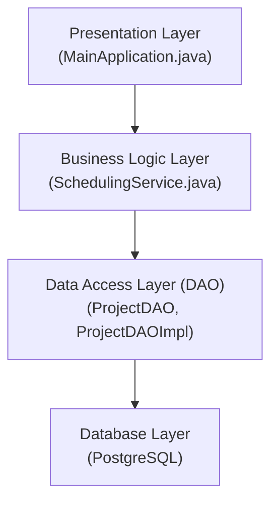
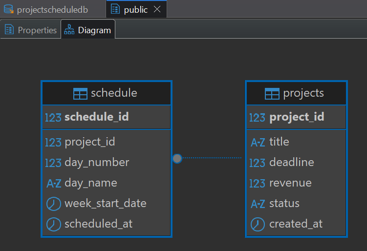
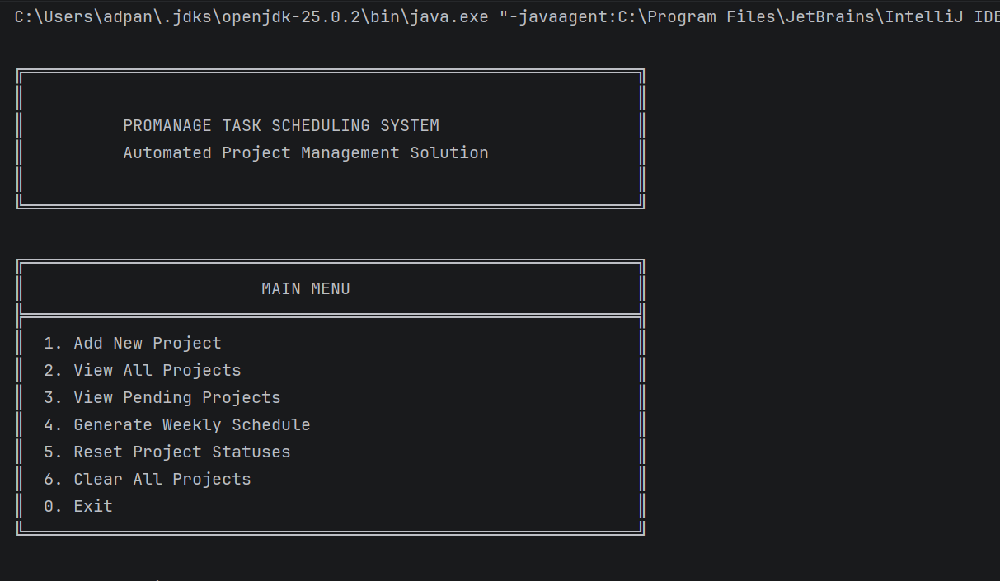
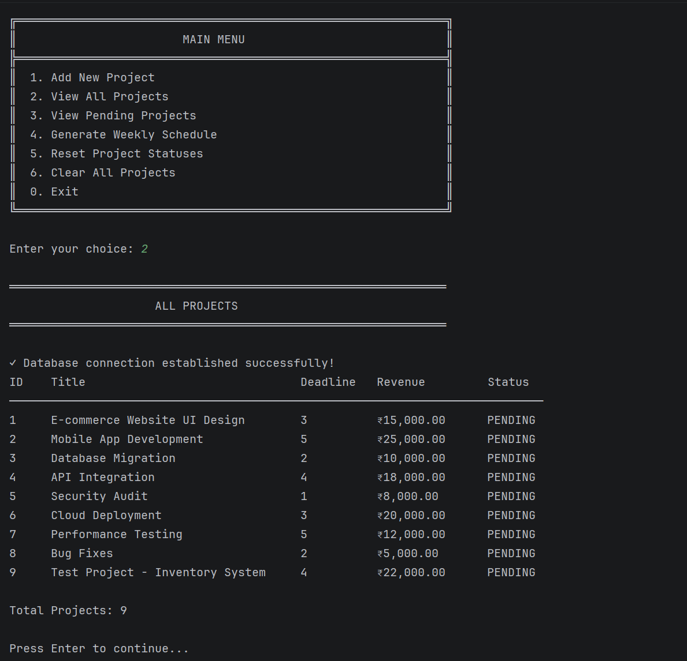
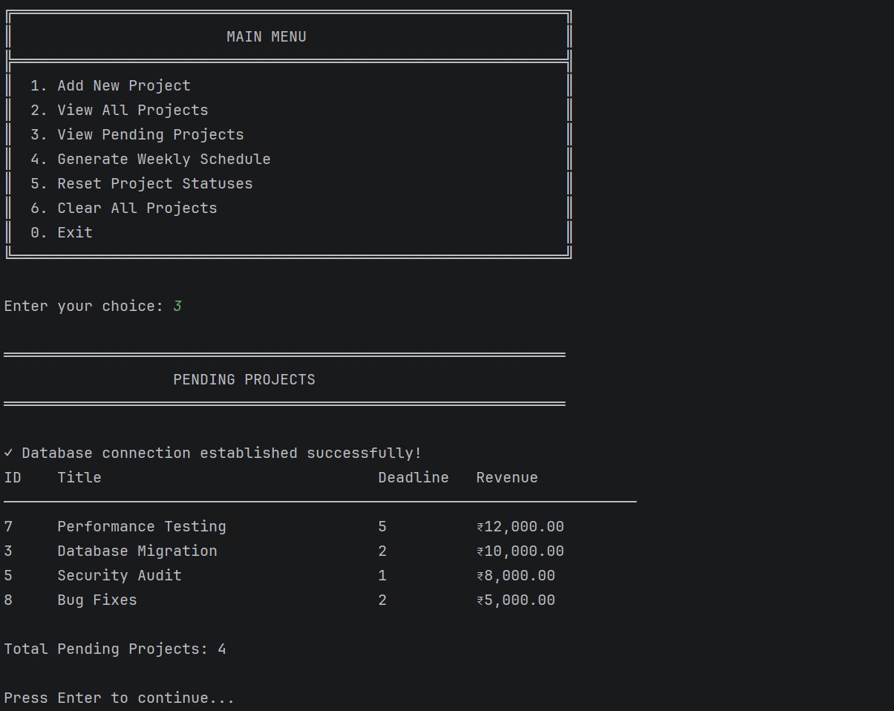
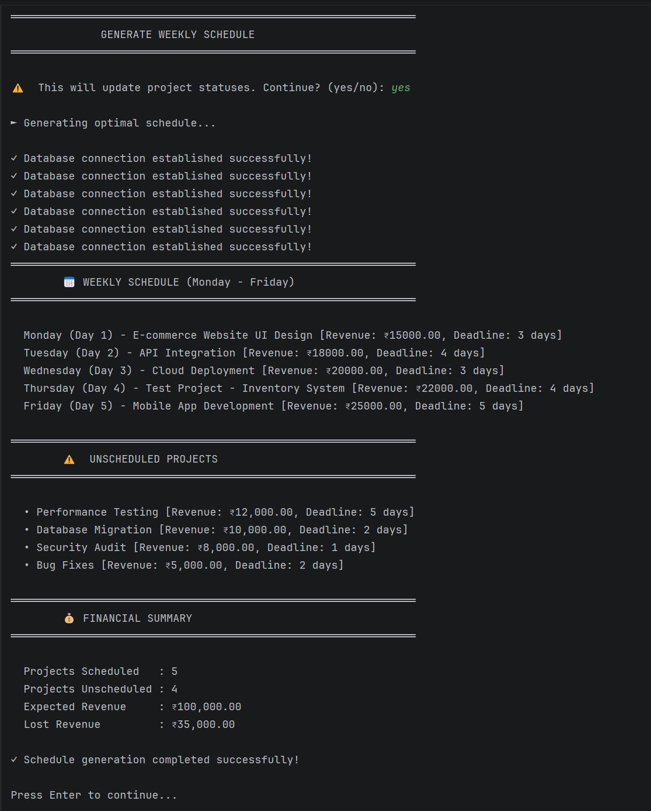

# ProManage - Automated Task Scheduling System

[](https://www.oracle.com/java/)
[](https://www.postgresql.org/)
[](https://maven.apache.org/)
[](LICENSE)

> A Java-based automated project scheduling system that optimizes weekly task allocation to maximize revenue while respecting project deadlines.

---

## 📋 Table of Contents

- [About the Project](#about-the-project)
- [Features](#features)
- [Technology Stack](#technology-stack)
- [System Architecture](#system-architecture)
- [Database Schema](#database-schema)
- [Installation](#installation)
- [Usage](#usage)
- [Screenshots](#screenshots)
- [Algorithm Explanation](#algorithm-explanation)
- [Project Structure](#project-structure)
- [Contributing](#contributing)
- [License](#license)
- [Contact](#contact)

---

## 🎯 About the Project

ProManage Solutions Pvt. Ltd. handles multiple client software projects (UI design, development, testing, deployment). This system automates the weekly scheduling process to:

- **Maximize revenue** by selecting the most profitable projects
- **Respect deadlines** to avoid revenue loss
- **Optimize resource allocation** (max 5 projects/week, 1 per day)
- **Eliminate manual scheduling errors** through automation

### Business Rules

- ✅ Projects received by Saturday, planning done over weekend
- ✅ Work week: Monday to Friday (5 working days)
- ✅ Maximum 5 projects per week
- ✅ Only 1 project completed per day
- ✅ Projects not completed before deadline = revenue loss

---

## ✨ Features

- 🎯 **Intelligent Scheduling** - Greedy algorithm for optimal project selection
- 📊 **Revenue Optimization** - Maximizes weekly earnings
- 🗄️ **Database Persistence** - PostgreSQL for reliable data storage
- 🔄 **Auto-Generated IDs** - Seamless project tracking
- 📈 **Financial Analytics** - Real-time revenue calculations
- 🖥️ **User-Friendly Interface** - Menu-driven console application
- ✅ **Input Validation** - Robust error handling
- 🔐 **SQL Injection Prevention** - PreparedStatements for security

---

## 🛠️ Technology Stack

| Component | Technology |
|-----------|-----------|
| **Language** | Java 17 |
| **Database** | PostgreSQL 16 |
| **Build Tool** | Maven 3.8+ |
| **JDBC Driver** | PostgreSQL JDBC 42.7.1 |
| **IDE** | IntelliJ IDEA / Eclipse |
| **Design Patterns** | DAO, Singleton |

---

## 🏗️ System Architecture




---

## 🗃️ Database Schema

### Projects Table
```sql
CREATE TABLE projects (
    project_id INTEGER PRIMARY KEY,
    title VARCHAR(200) NOT NULL,
    deadline INTEGER CHECK (deadline > 0 AND deadline <= 5),
    revenue DECIMAL(10, 2) CHECK (revenue > 0),
    status VARCHAR(20) DEFAULT 'PENDING',
    created_at TIMESTAMP DEFAULT CURRENT_TIMESTAMP
);
```

### Schedule Table
```sql
CREATE TABLE schedule (
    schedule_id SERIAL PRIMARY KEY,
    project_id INTEGER REFERENCES projects(project_id),
    day_number INTEGER CHECK (day_number >= 1 AND day_number <= 5),
    day_name VARCHAR(10),
    week_start_date DATE NOT NULL,
    scheduled_at TIMESTAMP DEFAULT CURRENT_TIMESTAMP
);
```



---

## 📥 Installation

### Prerequisites

Ensure you have the following installed:

- ✅ **Java JDK 17+** - [Download](https://www.oracle.com/java/technologies/downloads/)
- ✅ **PostgreSQL 14+** - [Download](https://www.postgresql.org/download/)
- ✅ **Maven 3.8+** - [Download](https://maven.apache.org/download.cgi)
- ✅ **Git** - [Download](https://git-scm.com/downloads)

### Step 1: Clone the Repository

```bash
git clone https://github.com/yourusername/promanage-scheduler.git
cd promanage-scheduler
```

### Step 2: Set Up Database

1. **Start PostgreSQL service**

2. **Create database:**
```bash
psql -U postgres
CREATE DATABASE projectscheduledb;
\c projectscheduledb
```

3. **Run schema script:**
```bash
\i src/main/resources/schema.sql
```

4. **(Optional) Load sample data:**
```bash
\i src/main/resources/sample_data.sql
```

### Step 3: Configure Database Connection

Edit `src/main/java/com/promanage/utils/DatabaseConnection.java`:

```java
private static final String URL = "jdbc:postgresql://localhost:5432/projectscheduledb";
private static final String USERNAME = "postgres";
private static final String PASSWORD = "your_password_here";  // UPDATE THIS
```

### Step 4: Build the Project

```bash
mvn clean install
```

### Step 5: Run the Application

```bash
mvn exec:java -Dexec.mainClass="com.promanage.main.MainApplication"
```

---

## 🚀 Usage

### Main Menu Options

```
╔══════════════════════════════════════════════════════════════╗
║                        MAIN MENU                             ║
╠══════════════════════════════════════════════════════════════╣
║  1. Add New Project                                          ║
║  2. View All Projects                                        ║
║  3. View Pending Projects                                    ║
║  4. Generate Weekly Schedule                                 ║
║  5. Reset Project Statuses                                   ║
║  6. Clear All Projects                                       ║
║  0. Exit                                                     ║
╚══════════════════════════════════════════════════════════════╝
```

### Example Workflow

1. **Add Projects** (Option 1)
    - Enter project details: title, deadline (1-5), revenue

2. **View Pending Projects** (Option 3)
    - See all projects awaiting scheduling

3. **Generate Schedule** (Option 4)
    - System automatically creates optimal weekly schedule
    - Updates project statuses to "SCHEDULED"
    - Displays financial summary

4. **Reset (Optional)** (Option 5)
    - Reset all projects to "PENDING" for re-scheduling

---

## 📸 Screenshots

### Application Interface

The application provides a clean, menu-driven interface for easy navigation and project management.



### View All Projects

Display all projects with their current status, deadline, and revenue information.



### View Pending Projects

Shows all projects that are awaiting scheduling, sorted by revenue.



### Generate Weekly Schedule

The system generates an optimal schedule and displays scheduled projects along with financial summary.



### Database Schema

Entity-Relationship diagram showing the database structure.


---

## 🧮 Algorithm Explanation

### Greedy Job Scheduling with Deadlines

**Objective:** Maximize total revenue by selecting and scheduling projects optimally.

**Algorithm Steps:**

1. **Sort Projects** - Order by revenue (descending)
2. **Iterate** - For each project:
    - Find latest available slot before deadline
    - If slot available → schedule project
    - If no slot → mark as unscheduled
3. **Update Status** - Mark scheduled projects in database

### Example

**Input Projects:**
| Project | Deadline | Revenue |
|---------|----------|---------|
| A | 3 | ₹15,000 |
| B | 1 | ₹8,000 |
| C | 5 | ₹25,000 |
| D | 2 | ₹10,000 |

**Sorted by Revenue:**
C (₹25,000) → A (₹15,000) → D (₹10,000) → B (₹8,000)

**Scheduling Process:**
- **C** (deadline=5): Schedule on Day 5 ✅
- **A** (deadline=3): Schedule on Day 3 ✅
- **D** (deadline=2): Schedule on Day 2 ✅
- **B** (deadline=1): Schedule on Day 1 ✅

**Result:** All projects scheduled, Total Revenue = ₹58,000

### Time Complexity: O(n²)
### Space Complexity: O(n)

---

## 📁 Project Structure

```
ProjectScheduling/
│
├── pom.xml                                 # Maven configuration
├── README.md                               # This file
│
├── src/
│   ├── main/
│   │   ├── java/
│   │   │   └── com/
│   │   │       └── promanage/
│   │   │           ├── model/              # Data models
│   │   │           │   ├── Project.java
│   │   │           │   ├── ScheduledProject.java
│   │   │           │   └── ScheduleResult.java
│   │   │           │
│   │   │           ├── dao/                # Data Access Objects
│   │   │           │   ├── ProjectDAO.java
│   │   │           │   └── ProjectDAOImpl.java
│   │   │           │
│   │   │           ├── service/            # Business Logic
│   │   │           │   └── SchedulingService.java
│   │   │           │
│   │   │           ├── utils/              # Utilities
│   │   │           │   └── DatabaseConnection.java
│   │   │           │
│   │   │           └── main/               # Application Entry Point
│   │   │               └── MainApplication.java
│   │   │
│   │   └── resources/
│   │       ├── schema.sql                  # Database schema
│   │       └── sample_data.sql             # Sample data
│   │
│   └── test/
│       └── java/                           # Unit tests (optional)
│
├── database-schema.png                     # Database ER diagram
├── generate-schedule.png                   # Schedule generation screenshot
├── view-all-projects.png                   # Projects list screenshot
├── view-pending-projects.png               # Pending projects screenshot
└── welcome-screen.png                      # Application interface screenshot
```

---

## 🤝 Contributing

Contributions are welcome! Please follow these steps:

1. Fork the Project
2. Create your Feature Branch (`git checkout -b feature/AmazingFeature`)
3. Commit your Changes (`git commit -m 'Add some AmazingFeature'`)
4. Push to the Branch (`git push origin feature/AmazingFeature`)
5. Open a Pull Request

---

## 🙏 Acknowledgments

- [PostgreSQL Documentation](https://www.postgresql.org/docs/)
- [Maven Documentation](https://maven.apache.org/guides/)
- [Java JDBC Tutorial](https://docs.oracle.com/javase/tutorial/jdbc/)
- Greedy Algorithm inspiration from classic job scheduling problem

---

## 📊 Project Status

✅ **Completed** - All core features implemented and tested

### Future Enhancements (Optional)
- [ ] Web-based UI using Spring Boot
- [ ] REST API endpoints
- [ ] Multi-week scheduling
- [ ] Project priority levels
- [ ] Email notifications
- [ ] Export schedule to PDF/Excel
- [ ] User authentication

---

<div align="center">

**⭐ Star this repository if you found it helpful!**

Made with Aditya Pandey

</div>
```